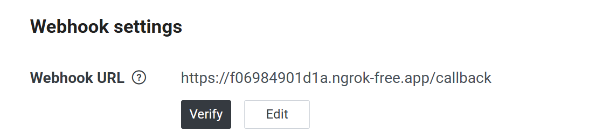
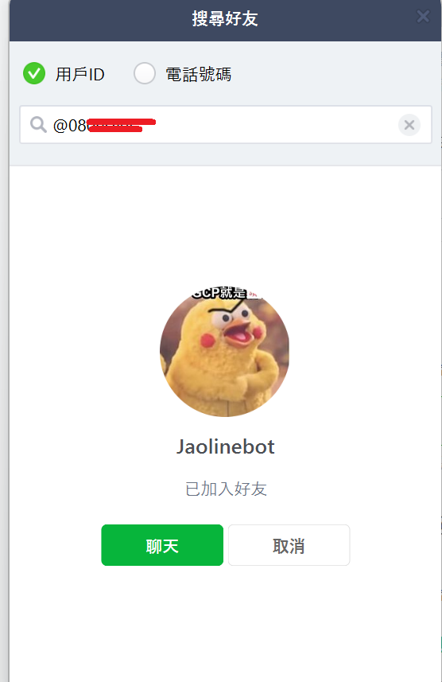
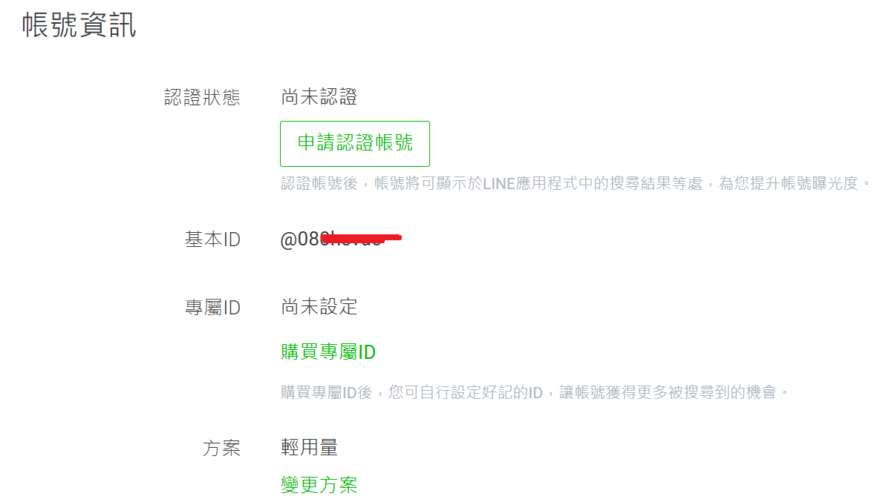
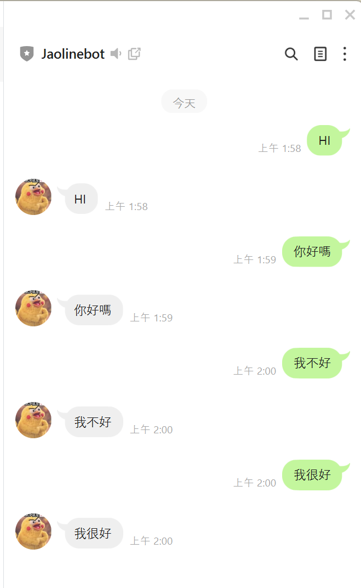

# pyngrok_Demo

這是一個使用 Flask 和 pyngrok 的範例專案，展示如何在 Codespaces 或本地環境中快速建立一個可公開存取的 Web 服務。

## 功能介紹

目前實作了以下功能：

1. **自動建立 ngrok 通道**：程式啟動時會自動建立一個公開的 HTTPS 網址，讓外部網路可以訪問您的 Flask 應用。
2. **Web 路由 (Routes)**：
    - `GET /`: 首頁，回傳 "Hello World"。
    - `GET /<name>`: 動態路由，會將網址中的名字作為參數，回傳 "Hello {name}"。

## 如何執行

1. **安裝依賴套件**：
   ```bash
   pip install -r requirements.txt
   ```

2. **執行程式**：
   ```bash
   python ngrok_demo.py
   ```

3. **取得網址**：
   程式啟動後，終端機會顯示 ngrok 的公開網址，例如：
   ```text
   * ngrok tunnel "https://xxxx.ngrok-free.app" -> "http://127.0.0.1:5000"
   ```

## 測試範例

假設您的 ngrok 網址為 `https://example.ngrok-free.app`：

- **測試首頁**: 
  - 網址: `https://example.ngrok-free.app/`
  - 結果: `Hello World`

- **測試動態名稱**: 
  - 網址: `https://example.ngrok-free.app/Tom`
  - 結果: `Hello Tom`
  - 您可以將 `Tom` 換成任何文字。

## LINE Bot 整合範例

除了基本的 Web 服務，本專案也提供了整合 LINE Bot 的範例 `line_bot_app.py`。

### 功能
- 建立一個 Echo Bot (回聲機器人)，會重複使用者傳送的文字訊息。
- 自動建立 ngrok 通道供 LINE Webhook 使用。

### 如何執行 LINE Bot

1. **設定 Token**:
   打開 `line_bot_app.py`，填入您的 LINE Channel Access Token 與 Channel Secret，以及 ngrok Token。
   
   - **Channel Secret**: 位於 LINE Developers Console 的 "Basic settings" 頁面。
   - **Channel Access Token**: 位於 "Messaging API" 頁面最下方。

2. **執行程式**:
   ```bash
   python line_bot_app.py
   ```
3. **設定 Webhook**:
   程式啟動後會顯示一組網址，請將該網址加上 `/callback` (例如 `https://xxxx.ngrok-free.app/callback`) 填入 LINE Developers Console 的 Webhook URL 欄位，並啟用 Webhook 功能。

   
   

## 注意事項

- 本專案中的 ngrok token 為範例用途，請勿在生產環境中使用。
- 每次重新啟動程式，ngrok 的網址可能會改變。

## 執行結果

1. **加入好友**：掃描 Messaging API 頁面上的 QR Code 加入機器人好友。
   
   

2. **測試對話**：傳送訊息給機器人，它會回覆相同的內容。
   
